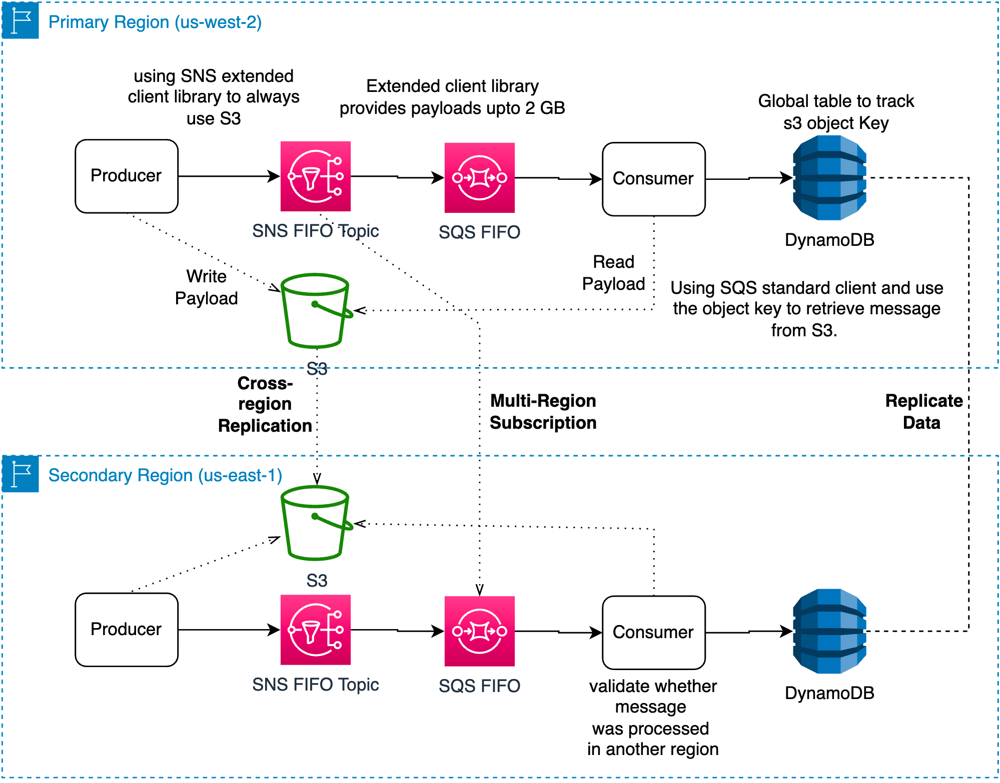
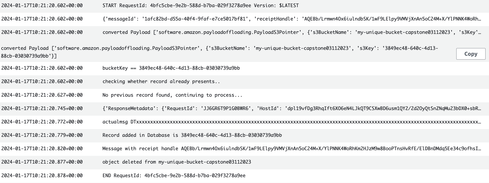
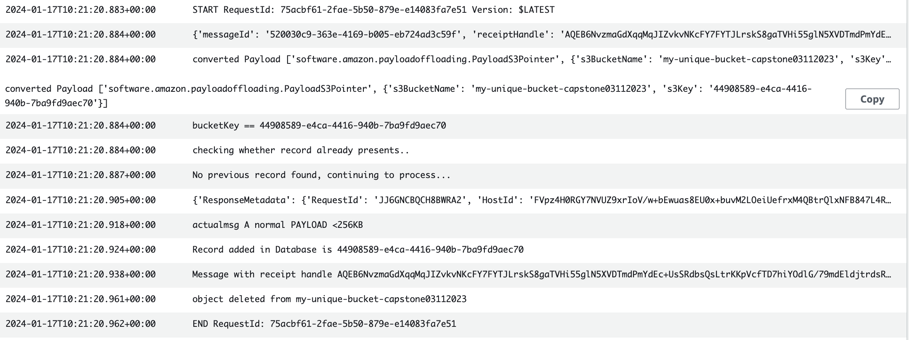
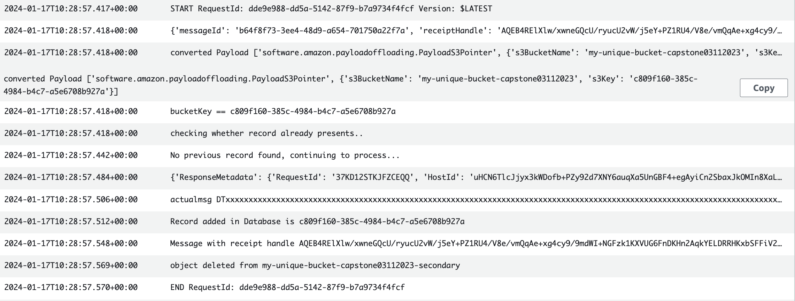
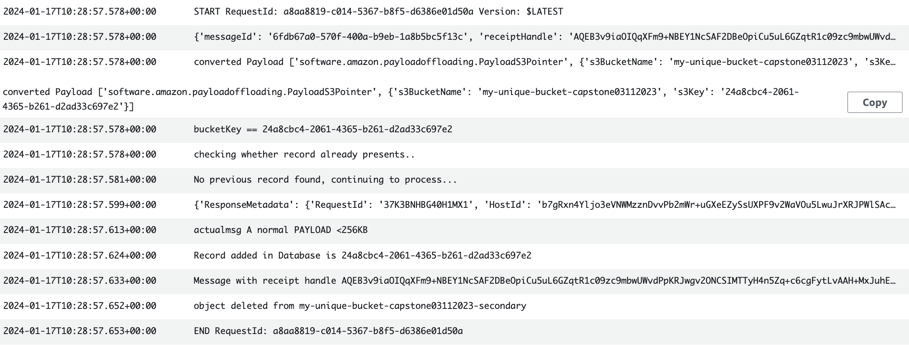

Multi region solution with SNS FIFO-SQS FIFO using DDB global tables
--------------------------------------------------------------------
Multi region solution using sns extended library allows to process messages >256KB. It involves setting up duplicate message queue that can handle payloads larger than 256 Kb while maintaining their sequence. The reference ID for every processed payload is stored in DynamoDB global table.
In addition, messages that have not been processed will be read in a backup region incase the main region encounters an issue.

## Architecture Diagram



## How it works

1. The producer application uses sns extended library to create a payload, each payload is saved in s3 and a reference i.e. s3 bucketkey is sent via sns and sqs topic for processing.
2. The consumer application will read the payload using sqs extended library, process it and store the reference ID (bucketkey) in DynamoDB global table. Global table is replicated across region, thus making sure that secondary region doesn't process same data in case of the failure.
4. In case of the primary region failure, unprocessed payload will be processed by consumer application in the secondary region. To avoid re-processing application will verify reference id with DynamoDB records, when an ID is found, the app will delete the payload from the secondary region s3 bucket and proceed to process the next payload.

## Requirements

1. [Create an AWS account](https://portal.aws.amazon.com/gp/aws/developer/registration/index.html) if you do not already have one and log in. The IAM user that you use must have sufficient permissions to make necessary AWS service calls and manage AWS resources.
2. [AWS CDK Toolkit](https://docs.aws.amazon.com/cdk/v2/guide/cli.html) installed and configured
3. [AWS CLI](https://docs.aws.amazon.com/cli/latest/userguide/install-cliv2.html) installed and configured 
4. [Install Git](https://git-scm.com/book/en/v2/Getting-Started-Installing-Git)
5. [Install Maven](https://maven.apache.org/install.html)
6. [Install Java](https://www.java.com/en/download/help/download_options.html)

## Deployment Instructions

1. Create a new directory, navigate to that directory in a terminal and clone the GitHub repository:
    ``` 
    git clone https://github.com/aws-samples/multiregion-s3-sns-sqs-lambda.git
    ```

2. To build this app, run mvn command. This will download the required dependencies to compile the Java code.
   ```
   mvn clean install
   ```

3. Open src/main/java/com/myorg/Multiregionwithextendedlib.java and edit below variables with your AWS account number and two region to deploy stack.
   
   static final String ACCOUNT = "000000";

   static final String REGION = "us-east-2";

   static final String REGION2 = "us-west-1"

4. From the command line, run cdk commands to synthesize and deploy stack.
   ```   
   cdk synth
   ```
   ```
   cdk bootstrap --all
   ```
   ```
   cdk deploy --all --require-approval never
   ```

5. Attach layer to lambda before test. Using your local terminal, run following commands 
   ```
   mkdir python
   ```
   ```
   cd python
   ```
   ```
   pip install amazon-sns-extended-client -t .
   ```
   ```
   rm -rf *dist-info
   ```
   ```
   cd..
   ```
   ```
   zip -r lambda-package.zip python
   ```
6. Upload the zip file to lambda layer directly or use s3 bucket to copy your zip package.
   

## **Testing**

1. From your primary region run orderCreationApp Lambda. Check DynamoDB table in both region for two rows entry. Entries/reference ID (bucketKey) has been replicated through global tables.

2. Similarly, check primary region cloudwatch logs (/aws/lambda/UserApplicationLambdaFunction) for the message that was sent. Note: actualmsg is printed for this demo purpose only.

   First message >256KB(Primary Region)

   

   Second message <256KB (primary Region)

   


3. Create a manual failure, by removing SQS subscription from the primary region SNS.

4. Update the primary region orderCreationApp lambda as below.

   ```
     response = sns_extended_client.publish(
            TopicArn=demo_topic_arn, Message="DT"+LARGE_MSG_BODY , MessageGroupId="message2", MessageDeduplicationId="largeMessage2",
        )
        response = sns_extended_client.publish(
            TopicArn=demo_topic_arn, MessageGroupId="message2", MessageDeduplicationId="smallMessage2",
            Message="A normal PAYLOAD <256KB"
        ) 
   ```

5. Simulate failed messages, Run primary region orderCreationApp Lambda. Check secondary region cloudwatch logs (since you have removed the connection between SNS and SQS in the primary region all messages will be processed in the secondary region).

   First message >256KB (Secondary Region)

   

   Second message <256KB (Secondary Region)

   


## **Cleanup**

1. Manually delete both s3 buckets. OR run below command in your terminal

2. ``` 
   aws s3 rb s3://bucket-name --force  
   ```

3. ``` 
   cdk destroy --all
   ```

Copyright 2023 Amazon.com, Inc. or its affiliates. All Rights Reserved.
